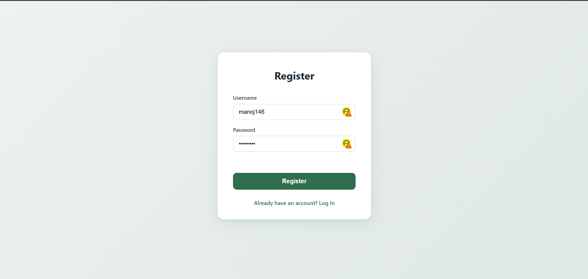
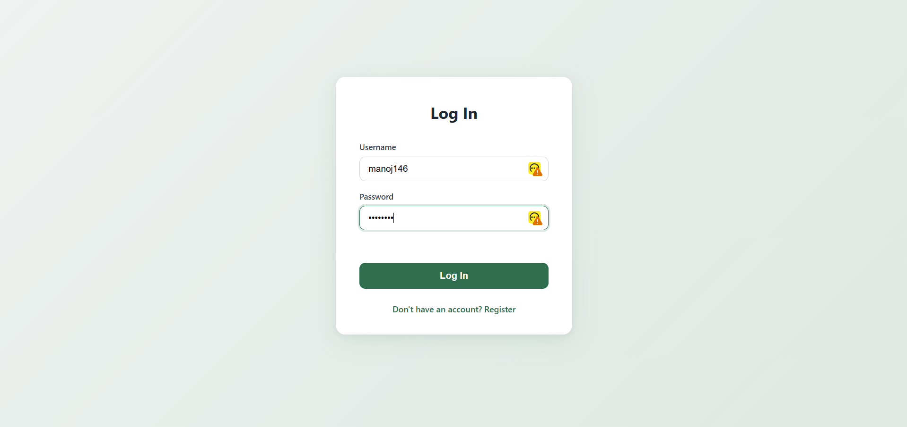
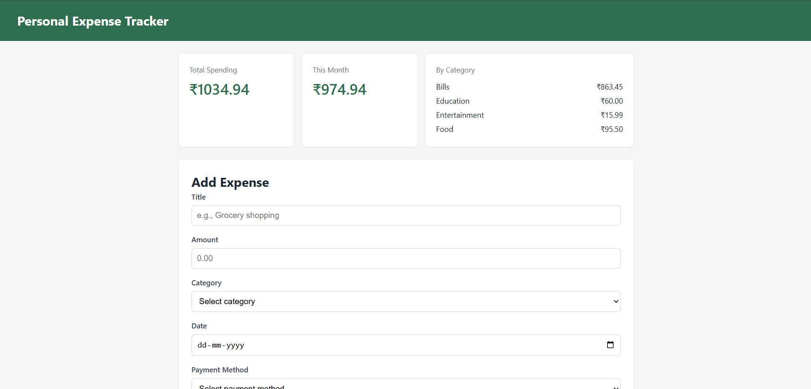
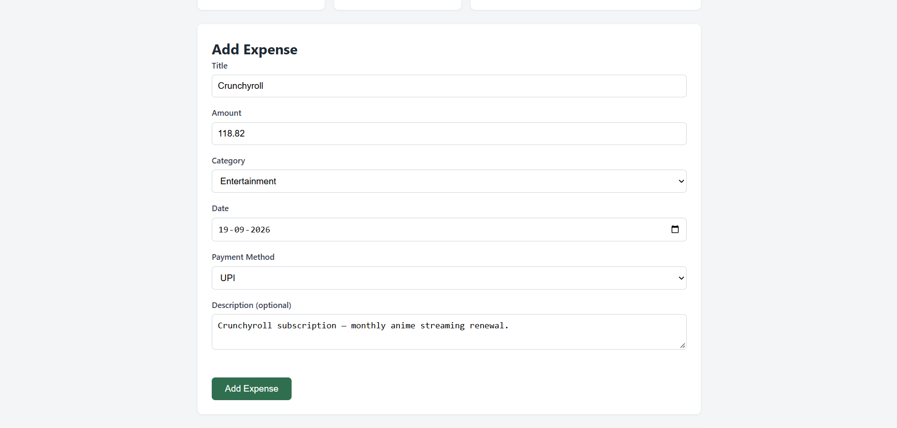
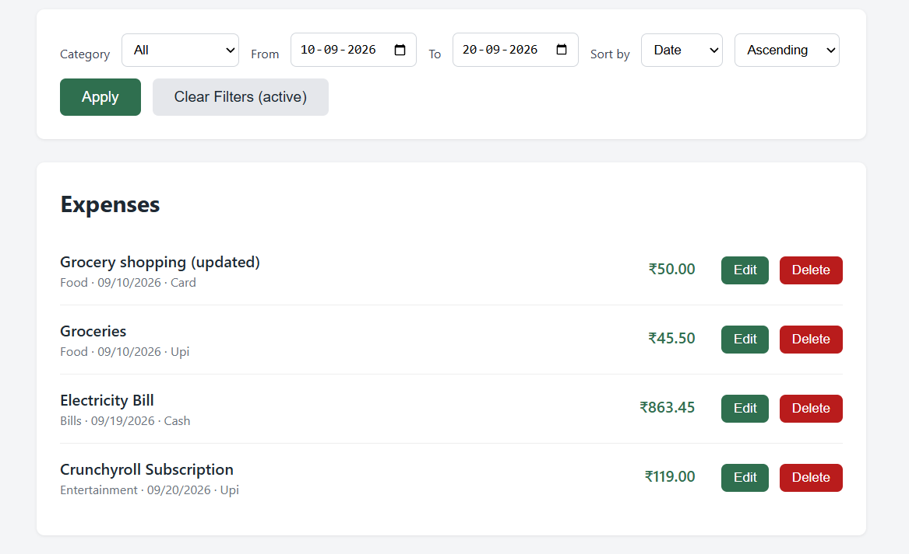
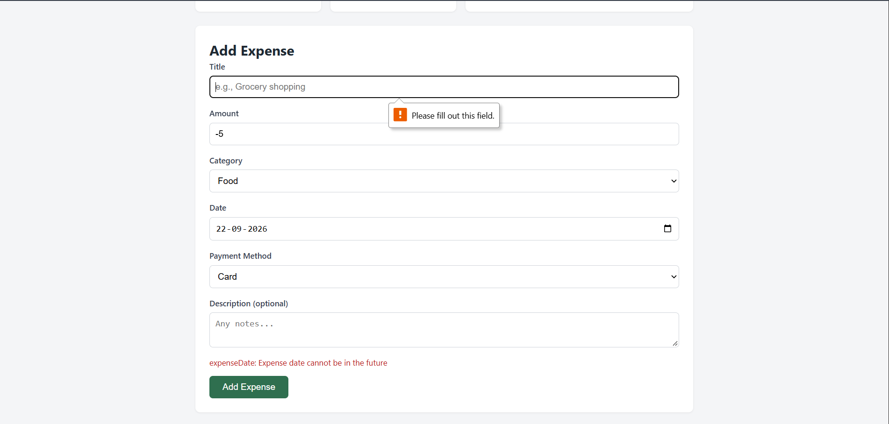

# Personal Expense Tracker

A full-stack CRUD application for tracking personal expenses, built with Java, Spring Boot, MySQL, and vanilla JavaScript — with JWT-based authentication so each user's expenses are private to their own account.

## Features

- User registration and login with JWT-based authentication
- Every expense is scoped to the authenticated user — enforced at the database query level, not just the UI
- Add, view, update, and delete expenses
- Filter by category or date range
- Sort by date or amount
- Dashboard with total spending, monthly spending, and category-wise breakdown
- Full backend validation with clear, field-level error messages
- Toast notifications, loading states, and friendly empty states on the frontend
- Automated unit and integration tests, including authenticated API flows

## Tech Stack

**Backend:** Java 21, Spring Boot 4, Spring Security, Spring Data JPA, Spring MVC, Bean Validation, Maven
**Auth:** JWT (jjwt), BCrypt password hashing, stateless session management
**Database:** MySQL (H2 for automated tests)
**Frontend:** HTML, CSS, vanilla JavaScript (fetch API)
**Testing:** JUnit 5, Mockito, AssertJ, MockMvc

## Architecture

```
Controller → Service → Repository → Database
```
- **Controller**: handles HTTP requests/responses, delegates to service
- **Service**: business logic, DTO ↔ Entity mapping, resolves the current authenticated user for every operation
- **Repository**: Spring Data JPA interface, persistence only — every expense query is scoped by user
- **Entity**: JPA-mapped database model (`Expense`, `User`)
- **DTO**: request/response shapes, decoupled from the entity
- **Security**: a `JwtAuthFilter` validates the token on every request; `SecurityConfig` defines which routes are public vs. protected
- **Exception handling**: centralized via `@RestControllerAdvice`, consistent error response shape across all endpoints, including authentication failures

## Security Model

- Passwords are hashed with **BCrypt** before storage — never stored in plain text
- On login, the server issues a **signed JWT** (HMAC-SHA256) containing the username and an expiry
- Every subsequent request must include this token in an `Authorization: Bearer <token>` header
- A custom `JwtAuthFilter` (a `OncePerRequestFilter`) validates the token on each request and populates Spring Security's context
- **Every expense query is filtered by the authenticated user at the repository level** (e.g., `findByIdAndUser`), not just checked in application code — this means one user can never access another's data even by guessing a valid expense ID
- Unauthenticated requests to protected endpoints return a clean `401 Unauthorized` JSON response via a custom `AuthenticationEntryPoint`
- The JWT signing secret is read from an environment variable (`JWT_SECRET`), never committed to source control

## Database Schema

```
┌───────────────────────────────────────┐      ┌───────────────────────────────────────┐
│                users                  │      │              expenses                 │
├───────────────────────────────────────┤      ├───────────────────────────────────────┤
│ id (PK)           BIGINT              │◄─────│ user_id (FK)     BIGINT               │
│ username          VARCHAR(50) UNIQUE  │      │ id (PK)          BIGINT               │
│ password          VARCHAR(255)        │      │ title            VARCHAR(100)         │
│ created_at        TIMESTAMP           │      │ amount           DECIMAL(10,2)        │
└───────────────────────────────────────┘      │ category         VARCHAR(50)          │
                                               │ expense_date     DATE                 │
                                               │ payment_method   VARCHAR(50)          │
                                               │ description      VARCHAR(255)         │
                                               │ created_at       TIMESTAMP            │
                                               └───────────────────────────────────────┘
```

**Indexes:** `expenses.category`, `expenses.expense_date`

```sql
CREATE TABLE users (
    id          BIGINT AUTO_INCREMENT PRIMARY KEY,
    username    VARCHAR(50)  NOT NULL UNIQUE,
    password    VARCHAR(255) NOT NULL,
    created_at  TIMESTAMP    NOT NULL DEFAULT CURRENT_TIMESTAMP
);

CREATE TABLE expenses (
    id              BIGINT AUTO_INCREMENT PRIMARY KEY,
    title           VARCHAR(100)  NOT NULL,
    amount          DECIMAL(10,2) NOT NULL,
    category        VARCHAR(50)   NOT NULL,
    expense_date    DATE          NOT NULL,
    payment_method  VARCHAR(50)   NOT NULL,
    description     VARCHAR(255),
    created_at      TIMESTAMP     NOT NULL DEFAULT CURRENT_TIMESTAMP,
    user_id         BIGINT        NOT NULL,
    CONSTRAINT fk_expenses_user FOREIGN KEY (user_id) REFERENCES users(id)
);

CREATE INDEX idx_expenses_category ON expenses(category);
CREATE INDEX idx_expenses_expense_date ON expenses(expense_date);
```

*(Full setup script in `/sql/schema.sql`)*

## API Endpoints

### Auth
| Method | Endpoint | Description |
|---|---|---|
| POST | `/api/auth/register` | Create an account, returns a JWT |
| POST | `/api/auth/login` | Authenticate, returns a JWT |

### Expenses *(all require `Authorization: Bearer <token>`)*
| Method | Endpoint | Description |
|---|---|---|
| POST | `/api/expenses` | Create an expense |
| GET | `/api/expenses` | Get all of the current user's expenses (supports `sortBy`, `direction`) |
| GET | `/api/expenses/{id}` | Get one expense by ID |
| PUT | `/api/expenses/{id}` | Update an expense |
| DELETE | `/api/expenses/{id}` | Delete an expense |
| GET | `/api/expenses/category/{category}` | Filter by category |
| GET | `/api/expenses/date-range?startDate=&endDate=` | Filter by date range |
| GET | `/api/expenses/summary` | Total spending + category breakdown |
| GET | `/api/expenses/monthly-summary?year=&month=` | Total spending for a given month |

## API Documentation

Interactive Swagger UI is available once the app is running:
**http://localhost:8081/swagger-ui.html**

Register or log in via `/api/auth/register` or `/api/auth/login`, copy the returned `token`, click the **Authorize** button in Swagger UI, and paste it in (no need to type "Bearer " — Swagger adds that automatically). Every "Try it out" request from the UI will then include your token, so protected endpoints can be tested directly in the browser.

The raw OpenAPI 3.1 spec is also available at `http://localhost:8081/v3/api-docs`.

## Setup Instructions

1. Clone the repository
2. Create the database: run `sql/schema.sql` in your MySQL client
3. Set environment variables: `DB_PASSWORD`, `JWT_SECRET` (and optionally `DB_USERNAME`, which defaults to `root`)
4. Run the application: `./mvnw spring-boot:run`
5. Open `http://localhost:8081` in your browser — you'll be redirected to the login page, where you can register a new account

> Note: this project runs on port **8081** instead of the Spring Boot default (8080), configured in `application.properties`.

## Running Tests

```
./mvnw test
```
15 tests total: unit tests (service layer, mocked repository, business rules like `createdAt` preservation) and integration tests (full authenticated request lifecycle — register, login, and every CRUD operation — against an in-memory H2 database).

## Screenshots

### Register


### Login

### Dashboard


### Add Expense


### Filtered View


### Validation Error Handling


## Key Design Decisions

- **JWT over session-based auth** — stateless, so no server-side session storage is needed and the API scales horizontally without sticky sessions
- **User-scoped queries at the repository level** (e.g., `findByIdAndUser`) rather than fetch-then-check in application code — returns a uniform "not found" for both a nonexistent ID and someone else's ID, avoiding an enumeration side-channel
- **DTOs instead of exposing entities directly** — decouples API contract from persistence model, prevents clients from setting server-controlled fields like `id`/`createdAt`
- **`BigDecimal` for all money values** — avoids floating-point rounding errors inherent to `double`/`float`
- **Enums for category/payment method** — type safety, no invalid values, self-documenting
- **Centralized exception handling** — consistent error response shape across every endpoint, including a dedicated `401` handler for authentication failures
- **Constructor injection** — testability, immutability, fail-fast on missing dependencies
- **CSRF disabled, explicitly** — appropriate here because this is a stateless, token-based API (no auth cookies for a CSRF attack to ride on), not a blanket security shortcut

## Built on Spring Boot 4

This project targets **Spring Boot 4.1.1**, released mid-2026, which introduced a significant modular restructuring of starter dependencies, several package relocations, and breaking API changes compared to Spring Boot 3.x / Spring Security 6. Notable migration points handled in this project:

- `spring-boot-starter-web` → `spring-boot-starter-webmvc`
- A single `spring-boot-starter-test` → separate, technology-specific test starters (`spring-boot-starter-data-jpa-test`, `spring-boot-starter-validation-test`, `spring-boot-starter-webmvc-test`)
- Jackson 2's `ObjectMapper` → Jackson 3's `JsonMapper` in test code
- `@AutoConfigureMockMvc` relocated from `org.springframework.boot.test.autoconfigure.web.servlet` to `org.springframework.boot.webmvc.test.autoconfigure`
- `DaoAuthenticationProvider` in Spring Security 7 requires `UserDetailsService` via constructor injection; the `setUserDetailsService()` setter was removed
- Spring Security's default `403` response for missing (not just invalid) credentials was overridden with a custom `AuthenticationEntryPoint` to return the more REST-conventional `401`

## Debugging Notes

A few non-obvious issues worth documenting, since they took real diagnostic work to track down:

- **Test resources not loading**: `application-test.properties` was nested inside `src/test/java/.../resources` instead of `src/test/resources` — Maven's convention only recognizes the latter as a test resources root, so the file was silently ignored and tests fell back to the real MySQL datasource.
- **Hibernate generating MySQL syntax against H2**: the test config set `spring.jpa.database-platform`, while the main config set the different property key `spring.jpa.properties.hibernate.dialect` — since the test file never overrode that specific key, Hibernate kept generating MySQL-flavored DDL (`ENGINE=InnoDB`, MySQL `ENUM(...)` columns) that H2 couldn't parse.